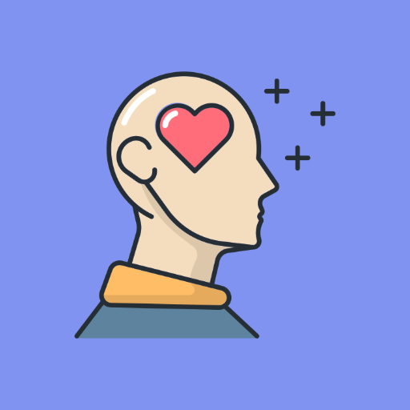
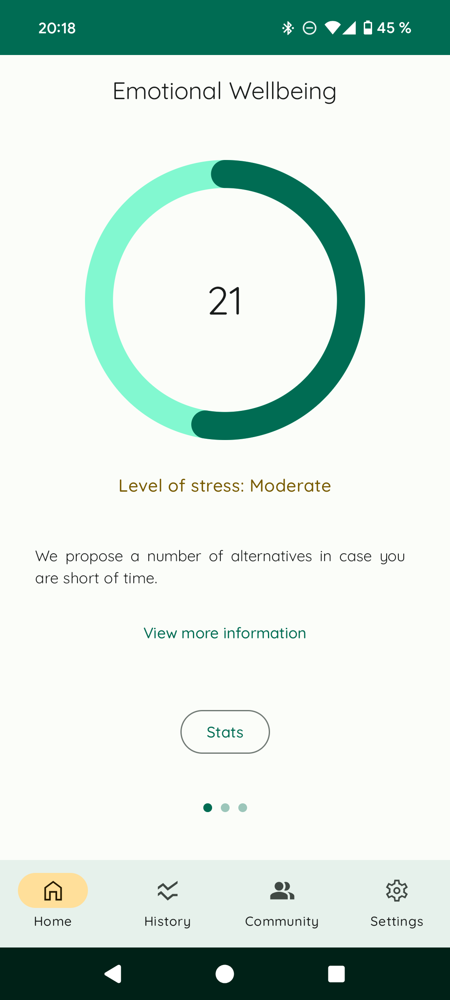
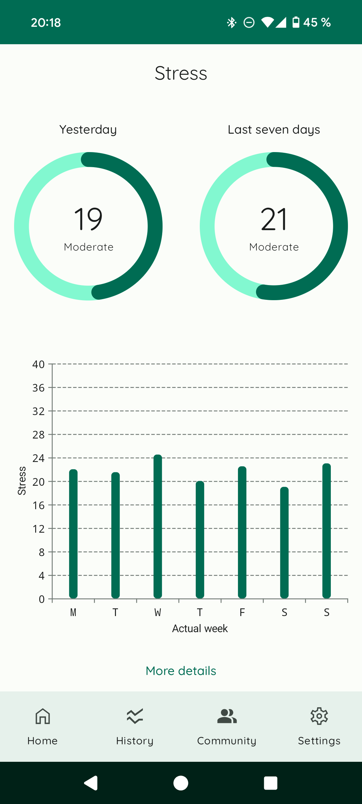
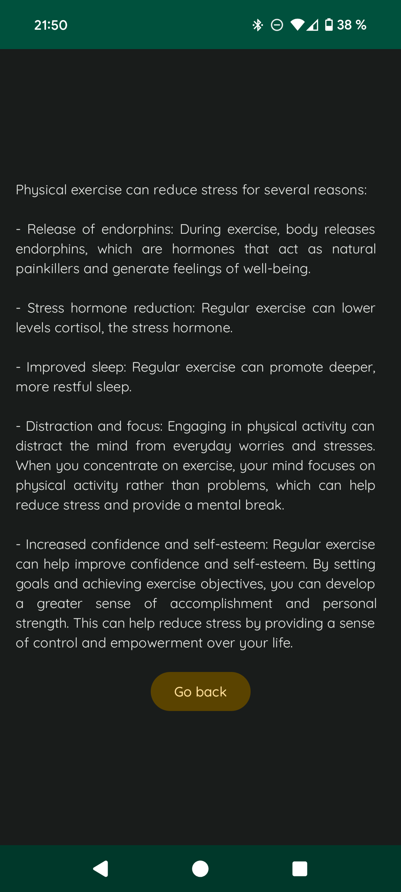
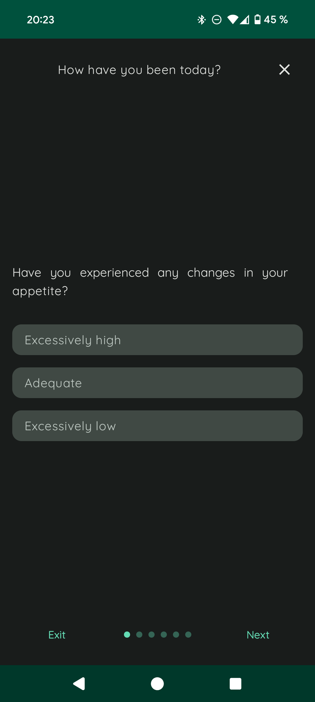
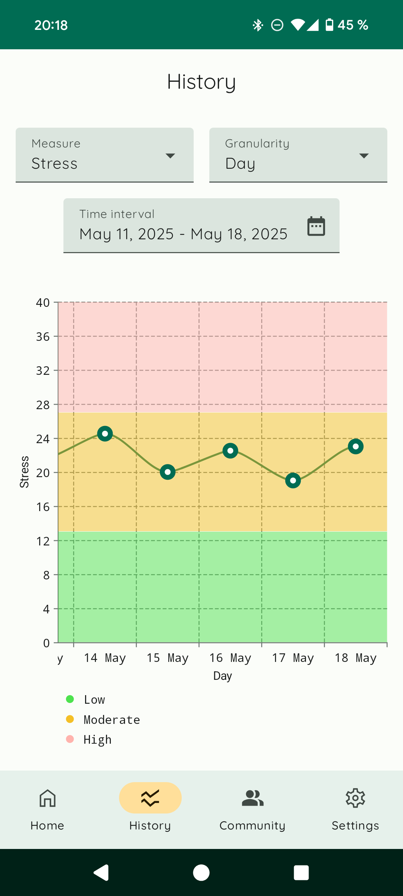
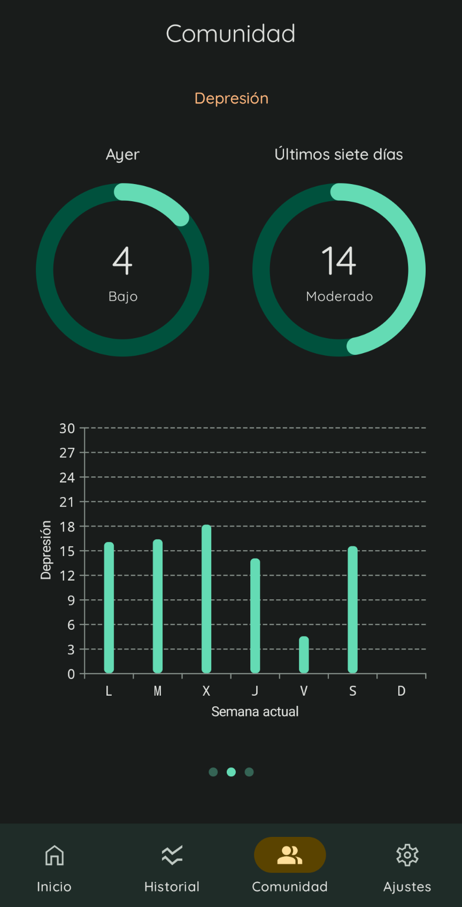
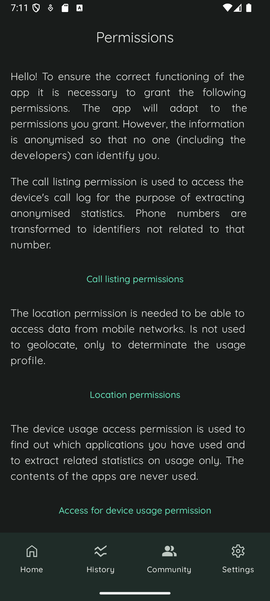
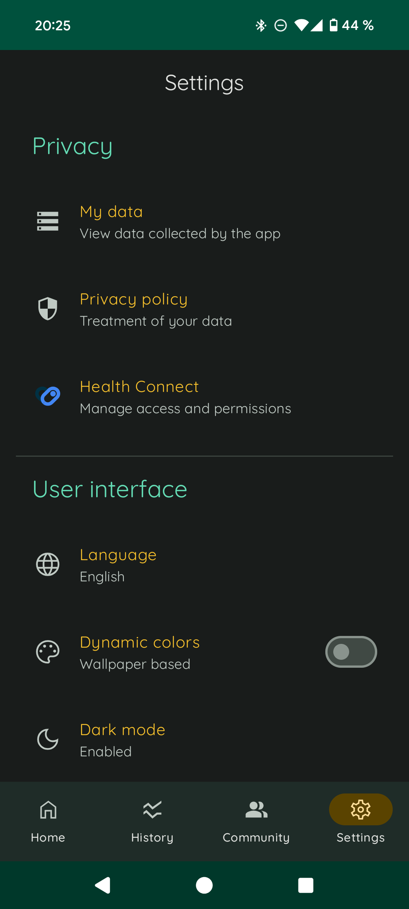

    
    <h3 align="center">Emotional Wellbeing App</h3>
    
Final Masters Project to design and implement an application to detect stress, depression, loneliness and suicide risk, giving custom advices to users.

## Table of Contents

- [📘 Overview](#-overview)
- [🎯 Key Features](#-key-features)
- [🛠️ Tech stack](#tech-stack)
- [🚀 Getting Started](#-getting-started)
- [💙 Contributing](#-contributing)
- [⚠️ Disclaimer](#-disclaimer)

## 📘 Overview

This project is a modern Android app that allows the detection of mental disorders such as stress, depression, loneliness and suicide risk, through the extraction of data from wearable devices and the self-assessment questionnaires. 

*Emotional Wellbeing* provides indicators and charts of user's mental indicators, anonymized statistics on how the community is doing and, depending on the user's state, guidelines to improve user's emotional well-being and redirects, if necessary, to professional support. 

---

## 🧠 Key Features

- **User measures visualization**: As home screen, app offers briefly user status, showing today's level and advice extract.

  

Moreover, user can access more detailed information, like a bar chart of current week status, yesterday status and seven-days average; or the detailed advice depending on measure level.

  
  

- **Biometric Data Extraction**: The app integrates with wearable devices (only on Health Connect compatible devices, like Fitbit and Samsung wearables) to collect biometric data.

  

- **Self-Assessment Questionnaires**: Users can complete validated psychological questionnaires to evaluate their emotional state. These questionnaires are prompted twice a day via notifications, and they can be resumed anytime.

  
  

- **Advanced stats**: User can access historical data visualization in a line chart. Also, some filtering can be done: by measure, time interval and the granularity to group data.

  

Meanwhile, community status can be checked: for each measure, user can check yesterday, last seven days and current week averages.

  

- **User-Friendly Interface**: The app features an intuitive design, making it accessible to users without technical expertise. Also, app is available (and configurable) on light/dark mode and with wallpaper color schema (only in devices running Android 12). Some examples:
  
  * Onboarding:
    
    

    
    
    

  
  * Permission management:
    
    

      
    

  
  * Splash screen everytime that app is opened.
    
    

      
    

- **Multilingual Support**: App can be used in either English and Spanish. By default is used device language, but user can override this via settings panel.

  

## 🛠️ Tech Stack

- **Core**: Kotlin, Dagger Hilt
- **Frontend**: Jetpack Compose, Material Design 3, Vico, Navigation Compose and Lottie
- **Backend**: Health Connect, DataStore, Lingver, Retrofit, Room, SQL Cipher and Worker

## 🚀 Getting Started

1. Install [Health Connect app](https://play.google.com/store/apps/details?id=com.google.android.apps.healthdata&pli=1) in target if it runs Android 13 or lower and you don't have it.
2. For community graphs, run and [configure](app\src\main\java\es\upm\bienestaremocional\data\RemoteConstants.kt) an instance of [API Service](https://github.com/Emotional-Wellbeing/Api).
3. Code can be compiled in Android Studio with a JDK 17. If you don't have or aren't sure about that, go to File | Settings | Build, Execution, Deployment | Build Tools | Gradle and download a JDK selecting Version 17.

## 💙 Contributing

Any contributions you make are **greatly appreciated**, so if you have any idea of how to make this project better, please [create a pull request](https://github.com/Emotional-Wellbeing/App/pulls). Also if you find any bug, please [create an issue](https://github.com/Emotional-Wellbeing/App/issues/new).

## ⚠️ Disclaimer

This project was originally by [@VicDominguez](https://github.com/VicDominguez) with the support of ETSISI-UPM (School of Computer Systems Engineering, Polytechnic University of Madrid) and [@maria-marco](https://github.com/maria-marco)
